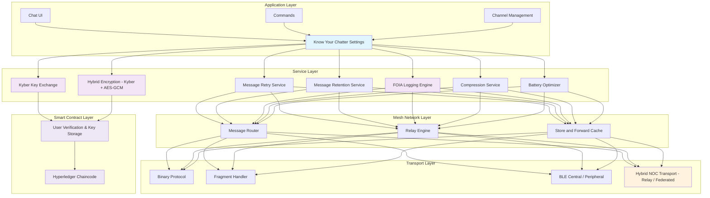

---

#### Blockitecture Project Overview - QBBC (Quantum Blockchain Bitchat)

The Blockitecture project is designed to enhance QBBC's modular architecture with advanced encryption and decentralized messaging capabilities.

#### Key Features

* **Encryption**: Integration of Kyber's key encapsulation mechanism (KEM) and hybrid encryption layer (Kyber + AES-GCM).
* **Blockchain**: Implementation of Hyperledger Fabric for tamper-proof key management.
* **Decentralized Transport**: Exploration of options inspired by BlackBerry Messenger's NOC.

#### Roadmap

1. **Discovery & Foundation**:
   * Break down bitchat codebase
   * Map data flow and message lifecycle

2. **Encryption Overhaul**:
   * Integrate Kyber key exchange
   * Build hybrid encryption layer (Kyber + AES-GCM)
   * Validate performance under load

3. **Blockchain Infrastructure**:
   * Set up Hyperledger Fabric
   * Create smart contracts for key management
   * Test key submission and retrieval

4. **Integration**:
   * Connect app modules with Fabric
   * Add UI toggles for enterprise features
   * Test edge cases

#### Updated Layered Architecture Diagram

